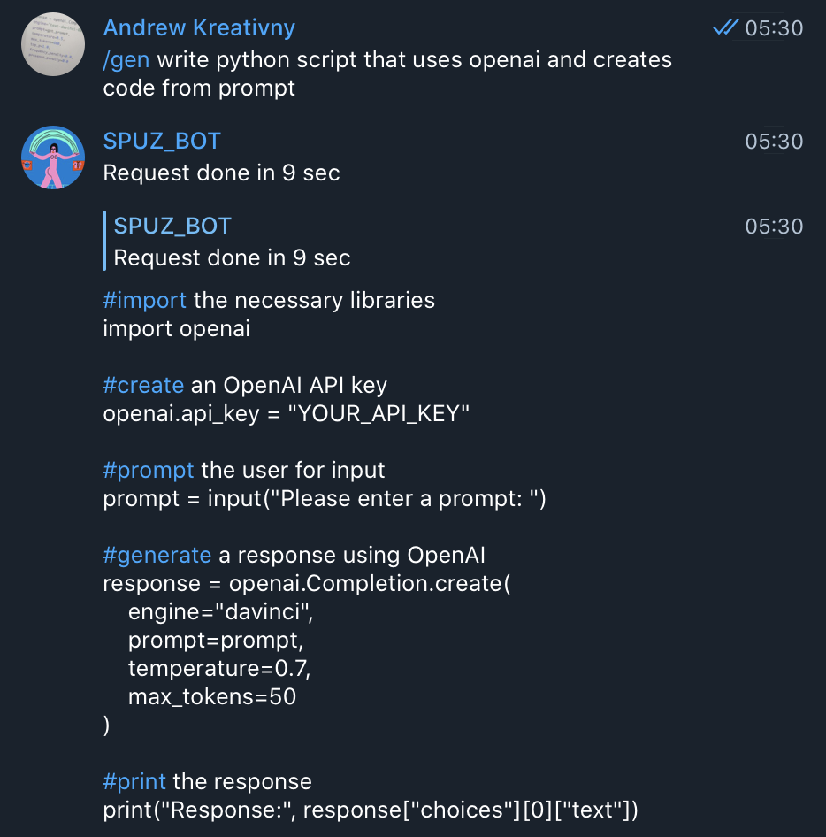

# Use API from OpenAI for creating text in Telegram

## Info

## Installing

1. Copy: git clone https://gitlab.com/SPUZ_/chatgpt-telegram-bot
2. Build: docker build -t chatgpt-telegram-bot .
3. Set "TELEGRAM_BOT_TOKEN, "OPENAI_API_TOKEN", "USER_ALLOWED"
4. Done
